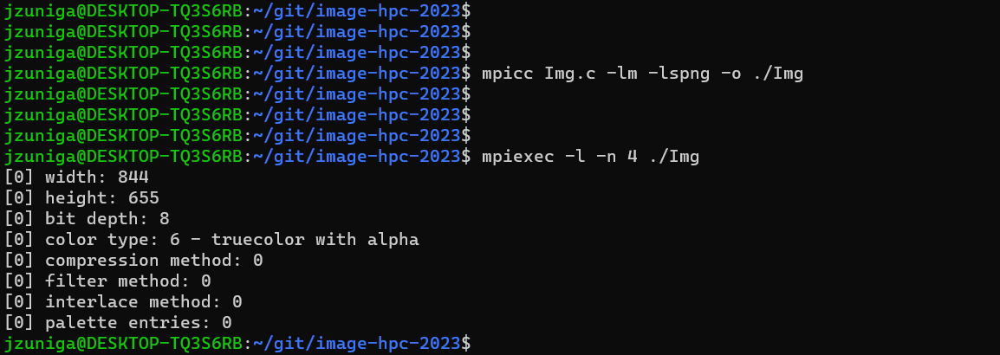

# image-hpc-2023

The main implementation done is the modification of the image, which is explained later in the document. The changes done and sending the result back to reassemble them again.

## Usage:
To run this project, you need to run the following command lines in the directory:
```
mpicc Img.c -lm -lspng -o ./Img
mpiexec -l -n 1 ./Img
```

## Expected output
After running the code, the following lines will appear in the command console:
```
[0] width: 844
[0] height: 655
[0] bit depth: 8
[0] color type: 6 - truecolor with alpha
[0] compression method: 0
[0] filter method: 0
[0] interlace method: 0
[0] palette entries: 0
```
Here's a screenshot of the output in the console:


## Image comparison
The modification made to the image in the directory is setting the red pixel values to 0, meaning that all the red is eliminated.

#### Input


#### Output

